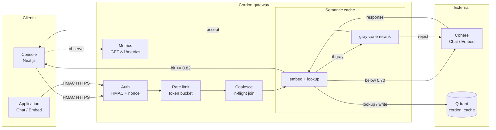

# Cordon

A signed, rate-limited, self-caching gateway for LLM APIs.

Cordon sits between your application and [Cohere Chat / Embed](https://docs.cohere.com/reference/about). It authenticates every request, enforces a per-key token bucket, joins identical in-flight calls, and serves a semantic cache from Qdrant so most traffic never reaches the provider.

This is a working local system, not a hosted production service.

## Architecture



Clients never talk to Cohere or Qdrant. Cordon is the only writer to the vector index. Gray-zone rerank sits **inside** the cache, not as a fifth gateway hop.

A successful proxy response includes `X-Cordon-Decision: cache | coalesced | origin`. Cache lookups also return similarity headers (`X-Cordon-Cache-Score`, `X-Cordon-Cache-Match`) so you can see why a request hit or missed.

## Prerequisites

- Python 3.12+
- Node.js 20+
- Docker
- A Cohere API key from the [Cohere dashboard](https://dashboard.cohere.com/api-keys)

## Setup

```bash
cp .env.example .env
```

Set at least:

```
COHERE_API_KEY=your_key_here
CORDON_API_KEYS=demo-key:demo-secret
```

## Run

Gateway + Qdrant:

```bash
docker compose up --build
```

- Health: `GET http://127.0.0.1:8000/health`
- Chat: `POST http://127.0.0.1:8000/v1/chat`
- Embed: `POST http://127.0.0.1:8000/v1/embed`
- Metrics: `GET http://127.0.0.1:8000/v1/metrics`

Console (separate terminal):

```bash
cd frontend
npm install
npm run dev
```

- Landing: [http://localhost:3000](http://localhost:3000)
- Console: [http://localhost:3000/console](http://localhost:3000/console)

The console signs as `demo-key` / `demo-secret` and calls `http://127.0.0.1:8000`.

**Demo path:** Send signed (origin, stores cache) → Send again (cache) → Burst x4 (coalesce) → Unsigned (401).

Reset the vector store (empty cache):

```bash
docker compose down -v
docker compose up --build
```

## Signed requests

Unsigned, expired, or replayed calls are rejected before rate limit or cache.

Canonical string:

```
{METHOD}
{path}
{timestamp}
{nonce}
{sha256(raw_body)}
```

`X-Signature` is `hex(HMAC-SHA256(secret, canonical))`.

```python
import json
from app.clients.signer import sign_request

body = json.dumps({"messages": [{"role": "user", "content": "hello"}]}).encode()
headers = sign_request("POST", "/v1/chat", body, "demo-key", "demo-secret")
```

## Environment

| Variable | Default | Role |
|---|---|---|
| `COHERE_API_KEY` | — | Upstream key (backend only) |
| `CORDON_API_KEYS` | `demo-key:demo-secret` | HMAC key_id:secret pairs |
| `QDRANT_URL` | `http://localhost:6333` | Vector store |
| `CACHE_SIMILARITY_THRESHOLD` | `0.82` | Cosine score that counts as a cache hit |
| `CACHE_RETRIEVE_THRESHOLD` | `0.70` | Floor for nearest-neighbor lookup |
| `RATE_LIMIT_CAPACITY` | `30` | Token bucket size per API key |
| `RATE_LIMIT_REFILL_PER_SEC` | `5` | Bucket refill |

See `.env.example` for the full list.

## Tests

```bash
cd backend
pytest
```

Covers HMAC (valid / expired / replay / tamper), concurrent token-bucket races, coalescing, and cache hit/miss. Unit tests do not call Cohere.

Load script (running gateway + real Cohere key):

```bash
cd backend
python scripts/load_test.py --base-url http://127.0.0.1:8000
```

## Layout

```
backend/app/
  api/          HTTP routes
  layers/       auth, rate limit, cache, coalescer
  pipeline/     request path through those layers
  services/     Cohere, Qdrant, metrics
  clients/      HMAC signer
  schemas/      request/response models
frontend/       landing page + live console
```
